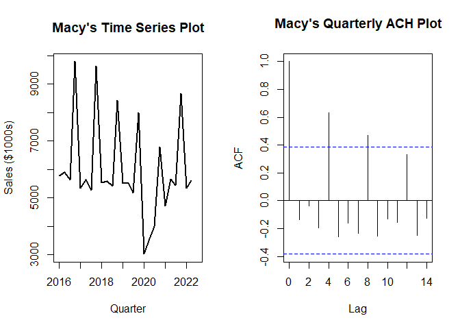
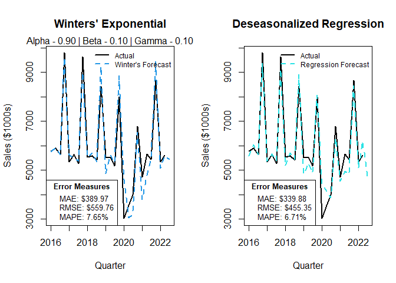
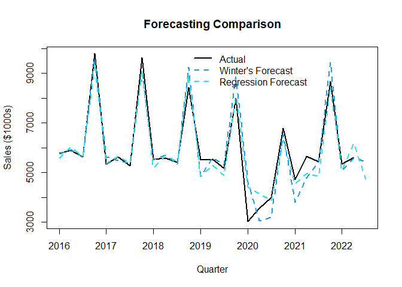

Macy’s Quarterly Sales Visual
================
Lindsey Dorson

``` r
library(readxl)
library(magrittr)
dat<-read_excel("C:/Users/Lindsey/Downloads/Macys Forecast.xlsx")


W<-ts(dat$`Winters Forecast`,frequency = 4, start = c(2016,1), end = c(2022,3))
R<-ts(dat$`Regression Forecast`,frequency = 4, start = c(2016,1), end = c(2022,3))
Macys<-ts(dat$Observed, frequency = 4, start = c(2016,1))

Macysacf<-dat$Observed %>%
  na.omit()
```

``` r
par(mfrow = c(1,2))

plot(Macys, xlab = "Quarter", ylab = "Sales ($1000s)",lwd =2)
title(main = "Macy's Time Series Plot")


#### ACF plot
acf(Macysacf,main = "Macy's Quarterly ACH Plot")
```

<!-- -->

``` r
# lags at intervals of 4, seasonality confirmed
```

``` r
par(mfrow = c(1,2))

################# Winters Forecast

plot(Macys, xlab = "Quarter", ylab = "Sales ($1000s)",lwd =2)
title(main = "Winters' Exponential")
par(bg="white")
lines(W,lwd =2,lty = 2, col = 4)


legend(x = "topright", 
       inset = c(0.00001,0),# Position
       legend = c("Actual", "Winter's Forecast"),  # Legend texts
       lty = c(1, 2),           # Line types
       col = c("black", 4),           # Line colors
       lwd = 2,
       bty = "n",
       cex =.77)      

legend(x = "bottomleft", 
       title = "Error Measures",
       title.font = 2,# Position
       legend = c("MAE: $389.97", "RMSE: $559.76", "MAPE: 7.65% "),
       cex = .8)
mtext("Alpha - 0.90 | Beta - 0.10 | Gamma - 0.10", side = 3)

################# Deseason Regression Forecast


plot(Macys, xlab = "Quarter", ylab = "Sales ($1000s)",lwd =2)
title(main = "Deseasonalized Regression")
par(bg="white")
lines(R,lwd =2,lty = 2, col = 5)


legend(x = "topright", 
       inset = c(0.00001,0),# Position
       legend = c("Actual", "Regression Forecast"),  # Legend texts
       lty = c(1, 2),           # Line types
       col = c("black", 5),           # Line colors
       lwd = 2,
       bty = "n",
       cex =.77)     
legend(x = "bottomleft", 
       title = "Error Measures",
       title.font = 2,# Position
       legend = c("MAE: $339.88", "RMSE: $455.35", "MAPE: 6.71% "),
       cex = .8)
```

<!-- -->

``` r
##### comparison model
par(mfrow = c(1,1))


plot(Macys, xlab = "Quarter", ylab = "Sales ($1000s)",lwd =2)
title(main = "Forecasting Comparison")
par(bg="white")
lines(W,lwd =2,lty = 2, col = 4)
lines(R,lwd =2,lty = 2, col = 5)


legend(x = "topright",          # Position
       legend = c("Actual","Winter's Forecast", "Regression Forecast"),  # Legend texts
       lty = c(1, 2, 2),           # Line types
       col = c("black",4, 5),           # Line colors
       lwd = 2,
       bty = "n",
       inset = c(0.2,0))     
```

<!-- -->
